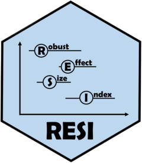

<!-- README.md is generated from README.Rmd. Please edit that file -->

```{r, include = FALSE}
knitr::opts_chunk$set(
  collapse = TRUE,
  comment = "#>",
  fig.path = "man/figures/README-",
  out.width = "100%"
)
```

# RESI 

<!-- badges: start -->
[](https://CRAN.R-project.org/package=RESI)
[](https://statimagcoll.github.io/RESI/) 
<!-- badges: end -->

RESI is an R package designed to implement the Robust Effect Size Index (RESI, denoted as S) described in Vandekar, Tao, & Blume (2020). The RESI is a versatile effect size measure that can be easily computed and added to common reports (such as summary and ANOVA tables). This package currently supports <code>lm</code>, <code>glm</code>, <code>nls</code>, <code>survreg</code>, <code>coxph</code>, <code>hurdle</code>, <code>zeroinfl</code>, <code>gee</code>, <code>geeglm</code>, <code>lme</code>, and <code>lmerMod</code> models. Nonparametric bootstrapping is used to compute confidence intervals, although the interval performance has not yet been evaluated for the longitudinal models. A Bayesian bootstrap is also available for <code>lm</code> and <code>nls</code> models. In addition to the main <code>resi</code> function, the package also includes a point-estimate-only function (<code>resi_pe</code>), conversions from S to other common effect size measures and vice versa, print methods, plot methods, summary methods, and Anova/anova methods. A more detailed vignette is being written.

If you would like to contribute to the package, please branch off of our [GitHub](https://github.com/statimagcoll/RESI) and submit a pull request describing the contribution. Please use the [GitHub Issues](https://github.com/statimagcoll/RESI/issues) page to report any problems and the [Discussions](https://github.com/statimagcoll/RESI/discussions/categories/q-a) page to seek additional support.


## References

Jones, M., Kang, K., & Vandekar, S. (2023). RESI: An R Package for Robust Effect Sizes. <i>arXiv preprint arXiv:2302.12345.</i>


Kang, K., Jones, M. T., Armstrong, K., Avery, S., McHugo, M., Heckers, S., & Vandekar, S. Accurate Confidence and Bayesian Interval Estimation for Non-centrality Parameters and Effect Size Indices. <i>Psychometrika.</i> 2023. 10.1007/s11336-022-09899-x. Advance online publication. https://doi.org/10.1007/s11336-022-09899-x.

Vandekar S, Tao R, Blume J. A Robust Effect Size Index. <i>Psychometrika.</i> 2020 Mar;85(1):232-246. doi: 10.1007/s11336-020-09698-2.

