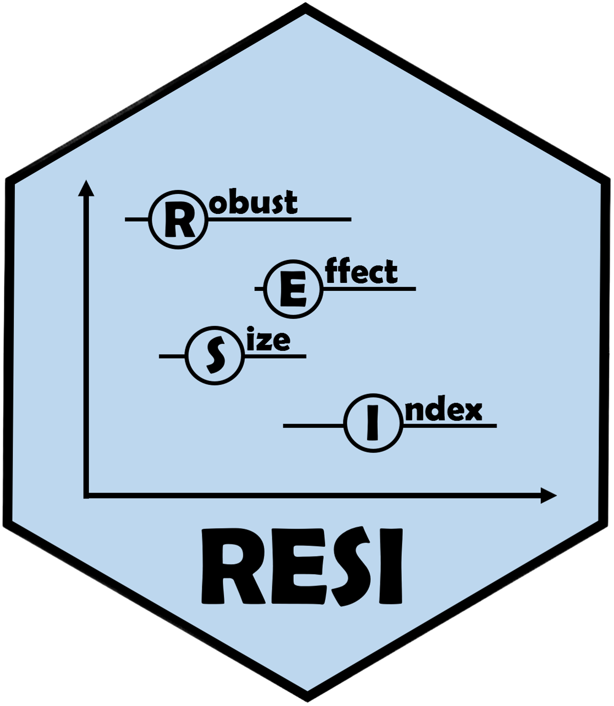

# RESI

RESI is an R package designed to implement the Robust Effect Size Index (RESI, denoted as S) described in Vandekar, Rao, & Blume (2020). The RESI is a versatile effect size measure that can be easily computed and added to common reports (such as summary and ANOVA tables). This package currently supports <code>lm</code>, <code>glm</code>, <code>nls</code>, <code>survreg</code>, <code>coxph</code>, <code>hurdle</code>, <code>zeroinfl</code>, <code>gee</code>, <code>geeglm</code>, <code>lme</code>, and <code>lmerMod</code> models. Nonparametric bootstrapping is used to compute confidence intervals, although the interval performance has not yet been evaluated for the longitudinal models. A Bayesian bootstrap is also available for <code>lm</code> and <code>nls</code> models. In addition to the main <code>resi</code> function, the package also includes a point-estimate-only function (<code>resi_pe</code>), conversions from S to other common effect size measures and vice versa, print methods, plot methods, summary methods, and Anova/anova methods. A more detailed vignette is being written.

## References
Vandekar S, Tao R, Blume J. A Robust Effect Size Index. <i>Psychometrika.</i> 2020 Mar;85(1):232-246. doi: 10.1007/s11336-020-09698-2.

Kang, K., Armstrong, K., Avery, S., McHugo, M., Heckers, S., & Vandekar, S. (2021). Accurate confidence interval estimation for non-centrality parameters and effect size  indices. <i>arXiv preprint arXiv:2111.05966.</i>
